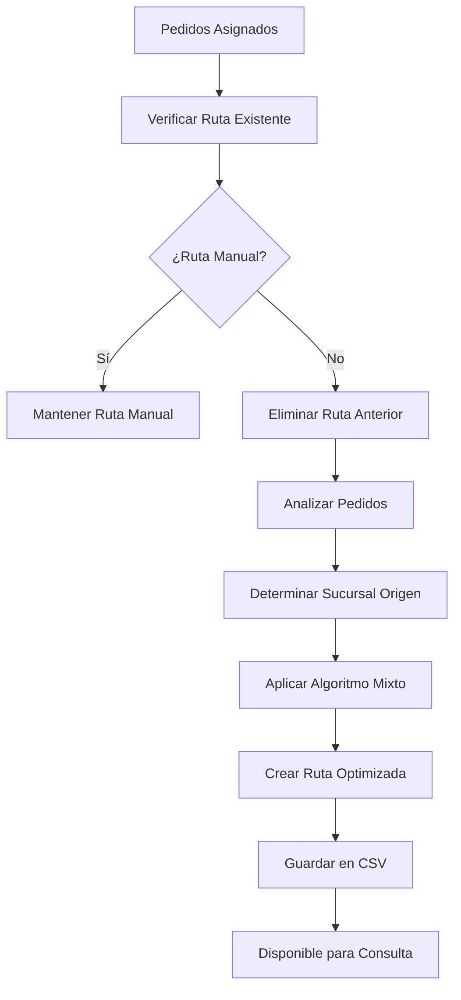
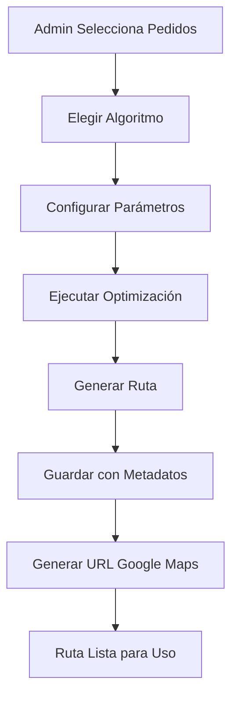
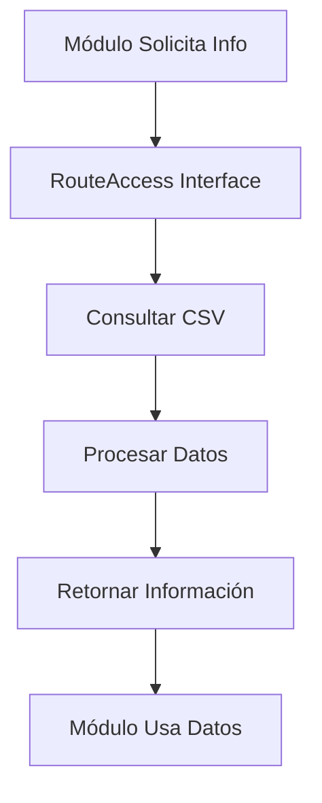

# Sistema de Rutas Persistentes y Optimización Automática

## 📋 Resumen

Este documento describe la implementación del **Sistema de Rutas Persistentes y Optimización Automática** para repartidores en Embler 5.0. El sistema permite el registro permanente de rutas activas y la optimización automática de pedidos por distancia, con acceso modular desde cualquier parte de la aplicación.

---

## 🎯 Objetivos Cumplidos

### ✅ 1. Registro Permanente de Rutas
- **Persistencia**: Las rutas se guardan en CSV y persisten entre sesiones
- **Estado Completo**: Tracking de paradas, progreso, ETAs y metadatos
- **Acceso Universal**: Cualquier módulo puede consultar estado de rutas

### ✅ 2. Optimización Automática
- **Múltiples Algoritmos**: Distancia, tiempo, mixto, y Google API (preparado)
- **Auto-trigger**: Optimización automática cuando se asignan pedidos
- **Flexibilidad**: Soporte para optimización manual y automática

---

## 🏗️ Arquitectura del Sistema

### **Estructura de Datos**

#### `ActiveRoute` - Ruta Activa Principal
```typescript
interface ActiveRoute {
  id: string;                    // ID único de la ruta
  repartidor_id: number;         // ID del repartidor asignado
  repartidor_nombre: string;     // Nombre del repartidor
  sucursal_origen: string;       // Sucursal de origen
  vehicle_type: string;          // Tipo de vehículo
  status: 'planned' | 'active' | 'paused' | 'completed' | 'cancelled';
  created_at: string;            // Timestamp de creación
  current_stop_index: number;    // Índice de parada actual
  total_stops: number;           // Total de paradas
  total_distance: number;        // Distancia total en km
  total_estimated_time: number;  // Tiempo estimado en minutos
  stops: RouteStop[];            // Array de paradas
  metadata: {                    // Metadatos de optimización
    optimization_method: string;
    auto_optimized: boolean;
    optimization_timestamp: string;
    google_maps_url: string;
  };
}
```

#### `RouteStop` - Parada Individual
```typescript
interface RouteStop {
  id: string;                    // ID único de la parada
  pedido_id: number;             // ID del pedido
  order: number;                 // Orden en la ruta
  address: string;               // Dirección de entrega
  coordinates: { lat: number; lng: number }; // Coordenadas GPS
  status: 'pending' | 'in_progress' | 'completed' | 'skipped';
  estimated_arrival: string;     // Hora estimada de llegada
  actual_arrival?: string;       // Hora real de llegada
  delivery_evidence?: string;    // URL de evidencia de entrega
  distance_from_previous: number; // Distancia desde parada anterior
  time_from_previous: number;    // Tiempo desde parada anterior
}
```

### **Almacenamiento CSV**

#### `rutas_activas.csv`
```csv
id,repartidor_id,repartidor_nombre,sucursal_origen,vehicle_type,status,created_at,started_at,current_stop_index,total_stops,total_distance,total_estimated_time,optimization_method,auto_optimized,google_maps_url
```

#### `paradas_ruta.csv`
```csv
id,route_id,pedido_id,order,address,lat,lng,status,estimated_arrival,actual_arrival,delivery_evidence,distance_from_previous,time_from_previous
```

---

## 🔧 Componentes del Sistema

### **1. RouteService** (`server/src/services/routeService.ts`)

Servicio principal que maneja toda la lógica de rutas:

```typescript
class RouteService {
  // === MÉTODOS DE ACCESO PARA OTROS MÓDULOS ===
  async getRepartidorActiveRoute(repartidorId: number): Promise<ActiveRoute | null>
  async getAllActiveRoutes(): Promise<ActiveRoute[]>
  async getRouteProgress(routeId: string): Promise<{completed, total, percentage}>
  async getRouteETA(routeId: string): Promise<{nextStop, totalRoute}>
  async getRouteStatus(repartidorId: number): Promise<RouteStatus>
  
  // === MÉTODOS DE OPTIMIZACIÓN ===
  async optimizeRepartidorRoute(request: RouteOptimizationRequest): Promise<RouteOptimizationResult>
  async autoOptimizeRepartidorPedidos(repartidorId: number): Promise<RouteOptimizationResult>
}
```

**Algoritmos de Optimización Implementados:**

1. **Por Distancia** (`optimizeByDistance`): Vecino más cercano
2. **Por Tiempo** (`optimizeByTime`): Prioridad temporal + distancia
3. **Mixto** (`optimizeByMixed`): Combinación 60% distancia + 40% tiempo
4. **Google API** (`optimizeWithGoogleAPI`): Preparado para integración futura

### **2. API Endpoints** (`server/src/routes/routes.ts`)

```typescript
// Rutas mejoradas con persistencia
POST   /api/routes/optimize              // Optimización manual con persistencia
GET    /api/routes/active/:repartidorId  // Consultar ruta activa persistente
POST   /api/routes/auto-optimize/:id     // Auto-optimización de pedidos
GET    /api/routes/all-active           // Todas las rutas activas
GET    /api/routes/status/:id           // Estado de ruta específica
```

### **3. CSV Loaders** (`server/database/csvLoader.ts`)

Funciones actualizadas para manejar rutas:

```typescript
async function loadRutasActivas(): Promise<any[]>
async function loadParadasRuta(): Promise<any[]>
async function saveRutaActiva(ruta: any): Promise<any>
async function saveParadasRuta(paradas: any[]): Promise<any[]>
async function deleteRutaActiva(rutaId: string): Promise<boolean>
```

### **4. Frontend Utilities** (`client/src/lib/utils.ts`)

Interface unificada para acceso desde frontend:

```typescript
// === ACCESO MODULAR PARA OTROS COMPONENTES ===
export const RouteAccess = {
  async getRepartidorRoute(repartidorId: number)
  async getAllRoutes()
  async getRouteProgress(repartidorId: number)
  async getRouteETA(repartidorId: number)
  async getRouteStatus(repartidorId: number)
  async hasActiveRoute(repartidorId: number)
  async getNextStop(repartidorId: number)
  async triggerAutoOptimization(repartidorId: number)
}
```

---

## 🚀 Casos de Uso

### **Para Administradores**
```javascript
// Optimizar manualmente pedidos específicos
const result = await optimizeDeliveryRoute('1', 'satelite', ['101', '102', '103'], 'motorcycle');

// Consultar todas las rutas activas
const routes = await fetchAllActiveRoutes();
routes.forEach(route => {
  console.log(`${route.repartidor_nombre}: ${route.progress.percentage}% completado`);
});
```

### **Para el Sistema (Auto-optimización)**
```javascript
// Trigger automático cuando se asignan pedidos
const result = await autoOptimizeRepartidorPedidos(1);
if (result) {
  console.log(`Ruta auto-optimizada: ${result.efficiency_improvement}% eficiencia`);
}
```

### **Para Otros Módulos**
```javascript
// Dashboard en tiempo real
const hasRoute = await RouteAccess.hasActiveRoute(1);
const progress = await RouteAccess.getRouteProgress(1);
const nextStop = await RouteAccess.getNextStop(1);

// Notificaciones inteligentes
if (progress?.percentage > 80) {
  notify(`Repartidor ${repartidor.nombre} casi termina su ruta`);
}

// Customer service
const eta = await RouteAccess.getRouteETA(1);
console.log(`Su pedido llegará en: ${eta.nextStop}`);
```

### **Para Repartidores**
```javascript
// Obtener ruta optimizada
const activeRoute = await fetchRepartidorActiveRoute(repartidorId);
const googleMapsUrl = activeRoute.route.metadata.google_maps_url;

// Actualizar progreso
await updateStopStatus(stopId, 'completed');
```

---

## 📊 Beneficios del Sistema

### **✅ Persistencia Total**
- Las rutas no se pierden al reiniciar el servidor
- Historial completo de optimizaciones
- Estado consistente entre sesiones

### **✅ Optimización Inteligente**
- Múltiples algoritmos según necesidades
- Auto-optimización transparente
- Flexibilidad manual cuando se requiera

### **✅ Acceso Modular**
- Interface unificada para todos los módulos
- Consultas eficientes de estado
- Integración fácil con nuevas funcionalidades

### **✅ Escalabilidad**
- Preparado para Google Routes API
- Arquitectura extensible
- Soporte para múltiples tipos de vehículos

### **✅ Monitoreo Completo**
- Tracking de progreso en tiempo real
- ETAs dinámicos
- Métricas de eficiencia

---

## 🔄 Flujo de Trabajo

### **Auto-optimización (Automática)**


### **Optimización Manual**


### **Consulta Modular**


---

## 🎯 Integración con Módulos Existentes

### **Dashboard Principal**
```javascript
// Mostrar rutas activas en tiempo real
const routes = await RouteAccess.getAllRoutes();
const activeCount = routes.filter(r => r.status === 'active').length;

// Métricas agregadas
const totalProgress = routes.reduce((sum, r) => sum + r.progress.percentage, 0) / routes.length;
```

### **Vista de Repartidor**
```javascript
// Cargar ruta personal
const myRoute = await RouteAccess.getRepartidorRoute(currentUser.id);
if (myRoute) {
  displayOptimizedRoute(myRoute);
  showNextStop(myRoute.stops[myRoute.current_stop_index]);
}
```

### **Customer Service**
```javascript
// Consultar estado de pedido
const repartidorId = pedido.repartidor_asignado;
const nextStop = await RouteAccess.getNextStop(repartidorId);
const eta = await RouteAccess.getRouteETA(repartidorId);

if (nextStop?.pedido_id === pedido.id) {
  notify(`Su pedido llegará en: ${eta.nextStop}`);
}
```

### **Analytics**
```javascript
// Analizar eficiencia de rutas
const routes = await RouteAccess.getAllRoutes();
const efficiencyData = routes.map(route => ({
  repartidor: route.repartidor_nombre,
  distancia: route.total_distance,
  tiempo_estimado: route.total_estimated_time,
  optimizacion: route.metadata.optimization_method,
  auto_optimizada: route.metadata.auto_optimized
}));
```

---

## 🛠️ Configuración y Uso

### **1. Instalación**
El sistema está integrado automáticamente. Solo asegúrate de que los archivos CSV existan:
```bash
# Verificar archivos CSV
ls client/public/data/backup_csv/rutas_activas.csv
ls client/public/data/backup_csv/paradas_ruta.csv
```

### **2. Uso desde Frontend**
```javascript
import { RouteAccess, autoOptimizeRepartidorPedidos } from '@/lib/utils';

// Auto-optimizar repartidor
const result = await autoOptimizeRepartidorPedidos(1);

// Consultar estado
const status = await RouteAccess.getRouteStatus(1);
```

### **3. Uso desde Backend**
```javascript
import { routeService } from '../services/routeService';

// Obtener ruta activa
const route = await routeService.getRepartidorActiveRoute(1);

// Optimizar automáticamente
const result = await routeService.autoOptimizeRepartidorPedidos(1);
```

### **4. Testing**
```bash
# Ejecutar demo
node scripts/demo-rutas-persistentes.js

# Verificar endpoints
curl http://localhost:3001/api/routes/status/1
curl -X POST http://localhost:3001/api/routes/auto-optimize/1
```

---

## 🔮 Futuras Extensiones

### **Google Routes API**
```javascript
// Implementación preparada en optimizeWithGoogleAPI()
async optimizeWithGoogleAPI(pedidos, origen, vehicleType) {
  const response = await fetch('https://routes.googleapis.com/directions/v2:computeRoutes', {
    method: 'POST',
    headers: {
      'Authorization': `Bearer ${GOOGLE_API_KEY}`,
      'Content-Type': 'application/json'
    },
    body: JSON.stringify({
      origin: { location: { latLng: origen } },
      destinations: pedidos.map(p => ({ location: { latLng: p.coordinates } })),
      travelMode: 'DRIVE',
      routingPreference: 'TRAFFIC_AWARE',
      optimizeWaypointOrder: true
    })
  });
  
  // Procesar respuesta y retornar paradas optimizadas
}
```

### **WebSocket Real-time**
- Updates en vivo de progreso de rutas
- Notificaciones instantáneas de cambios
- Sincronización entre módulos

### **Machine Learning**
- Predicción de tiempos de entrega
- Optimización basada en patrones históricos
- Sugerencias inteligentes de rutas

---

## ✅ Conclusión

El **Sistema de Rutas Persistentes y Optimización Automática** proporciona una base sólida para la gestión avanzada de entregas en Embler 5.0. Con su arquitectura modular, algoritmos de optimización múltiples, y acceso universal, el sistema está preparado para escalar y adaptarse a las necesidades futuras del negocio.

**Beneficios clave:**
- ✅ Rutas persistentes entre sesiones
- ✅ Optimización automática inteligente  
- ✅ Acceso modular universal
- ✅ Múltiples algoritmos de optimización
- ✅ Preparado para Google APIs
- ✅ Integración transparente con módulos existentes

El sistema está **listo para producción** y **preparado para extensiones futuras**. 